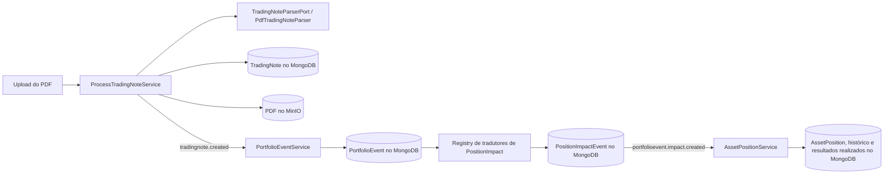

# Baseline arquitetural

Este documento descreve o repositório conforme observado em 2026-10-03. Ele registra fatos da implementação, não motivações históricas.

## Sistema e módulos

O Investment Manager aceita PDFs de notas de corretagem brasileiras e eventos corporativos explícitos, registra eventos de portfólio normalizados, deriva impactos de posição ordenados e recompõe posições de ativos e resultados realizados. Um pequeno frontend React/Vite apresenta atualmente um formulário de upload; a aplicação Spring Boot expõe o backend na porta 8080.

O reator Maven em Java 21 contém:

| Módulo | Responsabilidade observada |
| --- | --- |
| `commons` | Tipos de valor e enums compartilhados: corretora, dinheiro e tipos de ativo, operação e impacto. |
| `tradingnote` | Upload de PDF, extração específica por corretora, validação da nota, armazenamento do PDF, persistência da nota e publicação de eventos de nota criada. |
| `portfolioevent` | Tradução de operações de notas e eventos corporativos enviados por REST em eventos de portfólio e impactos de posição persistidos. Também canonicaliza corretoras e resolve detalhes de ativos. |
| `assetposition` | Reaplicação determinística dos impactos persistidos para produzir posições atuais, snapshots históricos, metadados de frações de desdobramento e resultados realizados de vendas. |
| `app` | Executável Spring Boot e configuração compartilhada de MongoDB e RabbitMQ; depende dos três módulos de negócio. |

As dependências visíveis nos POMs são `commons <- tradingnote`, `commons <- portfolioevent` e `commons + portfolioevent <- assetposition`; `app` compõe todos os módulos de negócio. O frontend é uma aplicação Vite separada, não um módulo Maven.

## Ports e adapters

Os módulos de negócio usam os pacotes `domain/model`, `domain/service` e `domain/port/{in,out}`. Configurações Spring constroem serviços de domínio a partir de ports; controllers REST e listeners Rabbit de entrada invocam ports de entrada, enquanto repositórios MongoDB, publishers RabbitMQ, clientes de armazenamento, implementações de parser e adapters de consulta entre módulos implementam ports de saída.

Os principais adapters de entrada são:

- `POST /api/trading-notes/upload` para notas em PDF;
- listener Rabbit da fila `tradingnote.created.queue` para conversão em eventos de portfólio;
- endpoints REST para subscrições, desdobramentos, bonificações, mudanças de ticker, conversões de ativos e eventos corporativos genéricos;
- listener Rabbit da fila `portfolioevent.impact.queue` para recálculo de posições.

As principais fronteiras de saída incluem `TradingNoteParserPort`, `FileStoragePort`, ports de repositório, os dois ports de publicação de eventos, `AssetDetailResolverPort`, registries de tradutores e aplicadores de impactos de posição e ports de consulta usados entre projeções. Essas interfaces e registries são pontos de extensão existentes. `FileStoragePort` possui um adapter MinIO ativo no profile `minio` e um adapter S3 incompleto no profile `s3`; isso é uma fronteira de capacidade, não evidência de que S3 esteja operacional.

## Fluxo principal de processamento

1. O controller entrega o stream enviado ao `ProcessTradingNoteService`. O serviço lê os bytes, calcula SHA-256 e devolve uma nota existente quando o hash do arquivo já está armazenado.
2. Caso contrário, ele invoca `TradingNoteParserPort`, armazena o PDF original por `FileStoragePort`, salva a `TradingNote` resultante e publica `TradingNoteCreatedEvent` no RabbitMQ.
3. `TradingNoteCreatedListener` mapeia cada operação para `CreatePortfolioEventsCommand`. `PortfolioEventService` resolve uma corretora canônica e detalhes estáticos do ativo, cria um evento por operação, filtra chaves determinísticas de idempotência já existentes e persiste os novos eventos.
4. `PositionImpactGenerationService` seleciona tradutores pelo tipo do evento, valida e persiste impactos únicos e então publica cada impacto.
5. `PortfolioEventProcessedListener` reage a um impacto solicitando que `AssetPositionService` recalcule a combinação afetada de ticker, tipo e corretora. O serviço consulta todos os impactos, reaplica-os na ordem da consulta por meio do registry de aplicadores de impacto, reescreve o histórico, faz upsert dos resultados realizados de vendas e salva a projeção atual de `AssetPosition`.

O código também declara uma rota `portfolioevent.processed`, mas o caminho observado da nota até a posição é acionado por `portfolioevent.impact.created`.

## Extração e validação de notas de corretagem

`TradingNoteParserPort` é a fronteira voltada ao domínio: recebe o conteúdo do PDF e devolve uma `TradingNote`. Seu adapter, `PdfTradingNoteParser`, executa um pipeline determinístico:

1. PDFBox lê os bytes do PDF e extrai o texto; documentos criptografados ou ilegíveis geram `PdfProcessingException`.
2. `TextNormalizer` normaliza o texto extraído.
3. É selecionado o primeiro `NoteExtractor` cujo método `supports` reconhece o documento da corretora. A factory padrão registra os extratores de Clear e NuInvest/Easynvest.
4. O extrator aplica expressões regulares específicas do layout e devolve `RawNoteData`, visível apenas no pacote: strings e records brutos de taxas e operações. Trata-se de um DTO do adapter, não de um objeto de domínio.
5. O parser converte datas, números decimais brasileiros, direção da operação, taxas e operações e então constrói `TradingNote`. Quando o total extraído de uma operação é zero, usa como fallback o preço unitário multiplicado pela quantidade.
6. `TradingNote` calcula o líquido das operações, separa IRRF dos custos operacionais, rateia os custos operacionais pelo volume bruto das operações e valida o resultado.

Os invariantes determinísticos da nota exigem número, corretora, data do pregão, ao menos uma operação e total diferente de zero. O rateio de custos pode divergir em no máximo 0,02; o valor líquido absoluto deve reconciliar com operações sinalizadas, custos operacionais e impostos retidos dentro do maior valor entre 0,5% e 1,00. Outros serviços de domínio validam campos obrigatórios, quantidades, proporções e valores positivos, relações permitidas e a estrutura dos impactos antes da persistência.

O port do parser permite uma implementação substituta ou complementar sem alterar seus consumidores. Um parser probabilístico ainda precisaria produzir uma `TradingNote` válida e ser avaliado contra a fronteira determinística de reconciliação.

## Persistência, mensageria e documentos

MongoDB é o banco de dados do sistema, configurado como `investmentmanager`. Documentos Spring Data cobrem notas de corretagem e impostos retidos; eventos de portfólio, catálogo de corretoras e impactos de posição; posições de ativos, histórico completo das posições e resultados realizados de vendas. Valores monetários usam conversões customizadas entre `BigDecimal` e `Decimal128`. Índices únicos reforçam as identidades de hash de arquivo, impacto de evento, posição, imposto retido, corretora e resultado realizado.

RabbitMQ usa mensagens JSON e filas duráveis. `tradingnote.exchange` distribui `tradingnote.created` para o processamento de eventos de portfólio e para a projeção de impostos retidos. `portfolioevent.exchange` encaminha impactos criados para o recálculo de posição e declara uma rota de evento processado. Falhas no cálculo de posição são publicadas explicitamente em `assetposition.calculated.dlq`; a publicação de impactos criados faz três tentativas no processo. Os listeners capturam e registram erros de processamento, portanto o repositório não demonstra outbox transacional nem entrega exatamente uma vez de ponta a ponta.

MinIO é o armazenamento de documentos ativo por padrão. Na inicialização, seu adapter tenta criar o bucket `trading-notes`; referências armazenadas têm o formato `bucket/nome-do-arquivo`. `docker-compose.yml` fornece serviços locais de MongoDB 7, RabbitMQ 3 Management e MinIO com volumes persistentes. Os valores padrão da aplicação e as credenciais do Compose são valores de desenvolvimento local.

## Idempotência e pontos de extensão

Os controles de duplicidade observados são dispostos em camadas:

- o hash SHA-256 do PDF é verificado antes da extração e do armazenamento e possui índice MongoDB único;
- uma `PortfolioEventIdempotencyKey` normalizada com SHA-256 combina tipo de evento, ativo, tipo de ativo, data, chave da corretora e referência de origem e possui índice único;
- impactos de posição são únicos por evento original, tipo de impacto e sequência;
- as projeções de imposto retido, posição de ativo, catálogo de corretoras e resultado realizado têm chaves únicas específicas do domínio;
- o cálculo da posição recompõe o estado a partir dos impactos persistidos, em vez de mutá-lo incrementalmente a cada entrega.

Essas verificações reduzem efeitos duplicados, mas são operações separadas de leitura, escrita e publicação, não uma única transação distribuída.

Os pontos de extensão existentes incluem `NoteExtractor`s específicos por corretora atrás de `TradingNoteParserPort`; profiles alternativos de armazenamento de arquivos; casos de uso de entrada de eventos de portfólio; `AssetDetailResolverPort`; tradutores de evento para impacto registrados por tipo de evento; aplicadores de impacto registrados por tipo de impacto; ports de repositório, publicação e consulta; e configurações de módulos Spring. Novas implementações devem preservar os contratos voltados ao domínio, salvo quando requisitos mensurados justificarem alterá-los.

## Build e execução

- Build do backend e todos os testes unitários: `mvn -f backend/pom.xml clean verify`.
- Build de produção do frontend: `npm --prefix frontend run build`.
- Infraestrutura local: `docker compose up -d`.
- Aplicação, após as dependências estarem disponíveis: `mvn -f backend/pom.xml -pl app -am spring-boot:run`.

O teste em lote do parser procura um diretório local `notas/` e é ignorado quando ele não existe; portanto, não constitui uma suíte autocontida de fixtures do parser.
